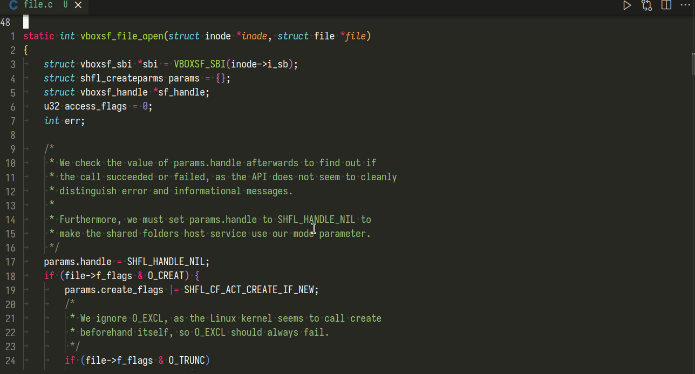
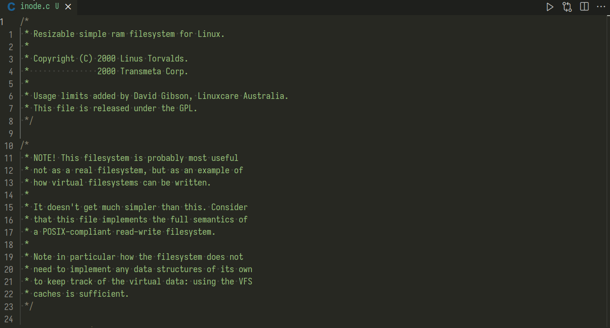

# Justify

Justify-align plain text.

## Features

- custom line width
- preserve indentation
- preserve multiline prefix
- preserve comments
- format text lists
- indent list items
- Markdown support
- LaTeX support

## Demo

Align code comments:



Align code comments with custom line width:



Align markdown:


## Extension Commands

The extension provides the following commands, with self-descriptive names:

- `Justify file`
- `Justify file (using custom line width)`
- `Justify line`
- `Justify line (using custom line width)`
- `Justify paragraph`
- `Justify paragraph (using custom line width)`
- `Justify selection`
- `Justify selection (using custom line width)`

The commands with custom line width will prompt the user for a line width  value
before executing.

## Extension Settings

The setting `justify.defaultLineWidth` specifies the default line width used  to
justify text when not using custom value provided by the user via prompt.

This value can be set on a per-language basis:

```json
{
    "justify.defaultLineWidth": 80,
    "[git-commit]": {
        "editor.rulers": [73],
        "justify.defaultLineWidth": 72,
    },
    "[plaintext]": {
        "justify.defaultLineWidth": 100,
    },
}
```
